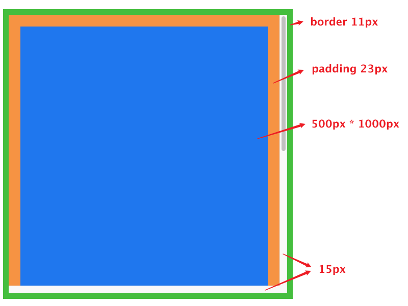

### 基础页面布局

```html
<div id="container">
  <div id="inner"></div>
</div>
```

```css
* {
  margin: 0;
  padding: 0;
}

#container {
  width: 500px;
  height: 500px;
  border: 11px solid #4bc133;
  padding: 23px;
  background: #f8a136;
  overflow-x: scroll;
  overflow-y: scroll;
}

#inner {
  height: 1000px;
  background-color: #1d84f7;
}
```



```javascript
const container = document.getElementById('container')
const inner = document.getElementById('inner')

console.log(container.clientWidth, container.clientHeight)  // 531 531
console.log(container.offsetWidth, container.offsetHeight)  // 568 568
console.log(container.scrollWidth, container.scrollHeight)  // 531 1046
```

### 隐藏滚动条后的结果

```css
#container::-webkit-scrollbar {
  display: none;
}
```


```javascript
console.log(container.clientWidth, container.clientHeight)  // 546 546
console.log(container.offsetWidth, container.offsetHeight)  // 568 568
console.log(container.scrollWidth, container.scrollHeight)  // 546 1046
```

### 结论

1. `clientWidth`和`clientHeight`的计算是`content + padding - 滚动条`
2. `offsetWidth`和`offsetHeight`的计算是`content + padding + border`
3. `scrollWidth`的计算是`内容 + padding - 滚动条`，而`scrollHeight`的计算是`内容 + padding`

> 注意：以上结论基于**Chrome浏览器**

### 判断滚动是否到底

```javascript
container.addEventListener('scroll', () => {
   if (container.scrollTop + container.clientHeight === container.scrollHeight) {
      console.log('到达底部')
   }
})
```

