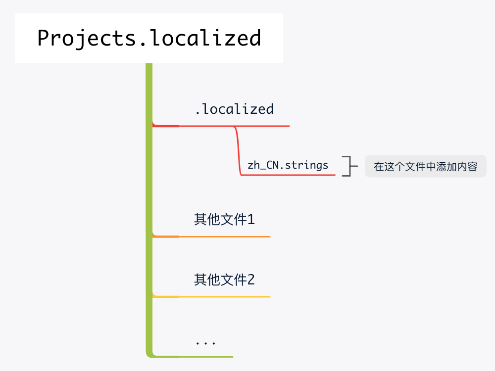

通常我们在使用命令行的时候，英文的目录结构会更加方便，而在使用访达的时候，中文的目录会更加直观。在MacOS系统中，`桌面`实际的文件名是`Desktop`，本文将介绍如何将这种形式扩展到任意自定义的文件夹

### 新建文件夹的命名方式

以在`~`目录下创建`项目`的文件夹文件夹为例，在命令行中执行如下命令

```
cd ~

mkdir Projects.localized
```

值得注意的是，这里文件夹`Projects`的后缀`.localized`是必须的

### 创建隐藏文件

然后执行如下命令，会在文件夹`Projects.localized`中新建一个隐藏文件夹`.localized`

```
cd Projects.localized

mkdir .localized
```

再进入文件夹`.localized`中，新建一个名为`zh_CN.strings`的文件，执行如下命令即可

```
cd .localized

touch zh_CN.strings
```

使用任意文本编辑器打开`zh_CN.strings`文件，并添加如下内容

`"Projects"="项目";`

注意，这里的`;`是必不可少的，且是英文分号

### 图释



