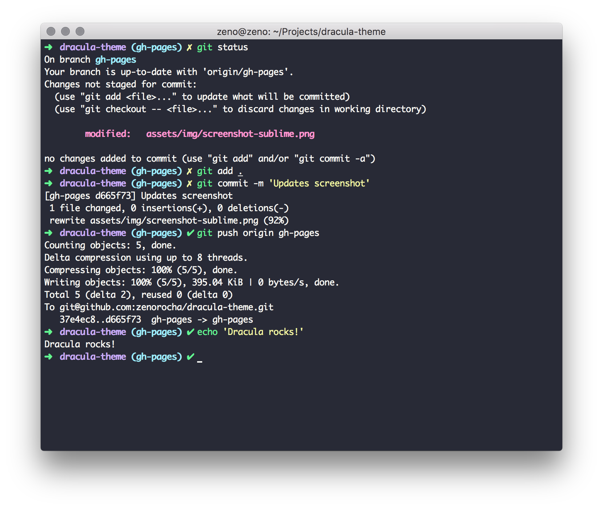
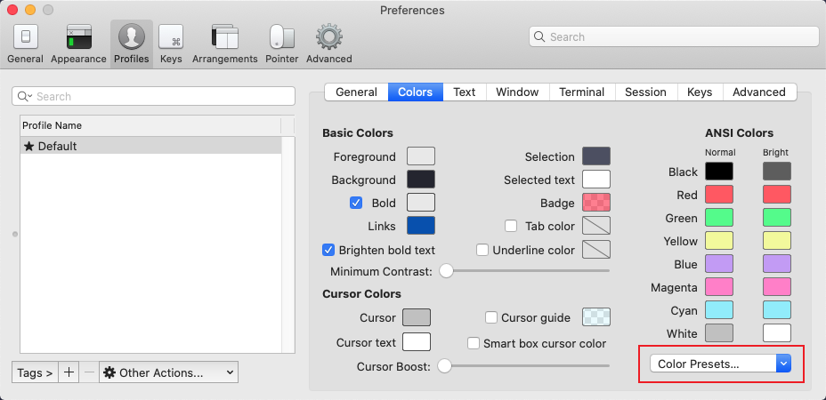

### oh my zsh的安装

`sh -c "$(curl -fsSL https://raw.github.com/ohmyzsh/ohmyzsh/master/tools/install.sh)"`

`sh -c "$(wget https://raw.github.com/ohmyzsh/ohmyzsh/master/tools/install.sh -O -)"`

### 主题推荐

Dracula主题下载 `git clone https://github.com/dracula/iterm.git`

打开`iTerm2 > Preferences`选择下图`Color Presets`中的`import`导入`Dracula.itermcolors`

导入成功之后，再选择`Dracula`主题即可

### 自定义命令

这里以Typora为例，在Mac上打开Typora的命令是

`open -a typora`

使用Typora打开`README.md`文件的命令是

`open -a typora README.md`

通过配置别名可以更加方便，打开`~/.zshrc`添加

`alias typora="open -a typora"`

### oh my zsh中的Git快捷命令

配置文件地址`~/.oh-my-zsh/plugins/git/git-plugin-zsh`，常用的一些快捷命令

| 快捷命令 | 完整命令                     |
| -------- | ---------------------------- |
| g        | git                          |
| ga       | git add                      |
| gcmsg    | git commit -m                |
| glo      | git log --oneline --decorate |
| gst      | git status                   |
| gco      | git checkout                 |
| gcb      | git checkout -b              |
| gb       | git branch                   |
| gcf      | git config --list            |

