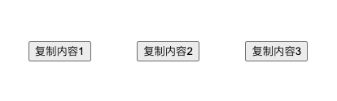

在Web页面中，常用到一个功能就是点击某个元素（通常是button）来实现复制的一段内容。主要的实现原理是利用JavaScript中提供的`document.execCommand()`，本文将在React Hooks中使用这个API来实现这个功能。

### 基本结构

首先构造三个按钮，然后需要实现的功能是点击不同的按钮可以将不同的内容复制到剪贴板



代码（TypeScript）实现如下：

```typescript
import React from 'react';

interface iProps {
  content: string
}

const Button: React.FC<iProps> = props => {
  const { content } = props
  return <button>{content}</button>
}

const App: React.FC = () => {
  const data = [
    '复制内容1',
    '复制内容2',
    '复制内容3',
  ]
  return (
    <div style={{width: 400, display: 'flex', justifyContent: 'space-around', margin: '100px auto'}}>
      {
        data.map((content, index) => <Button key={index} content={content}/>)
      }
    </div>
  )
}
```

### 实现原理

首先要明确两点：

1. 监听页面的`copy`事件，针对一个回调函数只能执行一次`addEventListener`。也就是要在最外层的组件中监听，而不是在多个子组件中监听
2. 组件卸载时要移除监听

#### 初始化复制内容

```typescript
let copyContent = ''
const setCopyContent = (value: string) => {
  copyContent = value
}
```

每次点击按钮之后，需要从`copyContent`中取值，而`setCopyContent`则是在点击的时候去改变`copyContent`中的值

#### 设置监听

```typescript
let copyContent = ''
const setCopyContent = (value: string) => {
  copyContent = value
}

const App: React.FC = () => {
  const data = [
    '复制内容1',
    '复制内容2',
    '复制内容3',
  ]
  
  useEffect(() => {
    const cb = (event: ClipboardEvent) => {
      event.clipboardData?.setData('text/plain', copyContent)
      event.preventDefault()
    }
    document.addEventListener('copy', cb)
    return () => document.removeEventListener('copy', cb)
  }, [])
  
  return (
    <div style={{width: 400, display: 'flex', justifyContent: 'space-around', margin: '100px auto'}}>
      {
        data.map((content, index) => <Button key={index} content={content} setCopyContent={setCopyContent} />)
      }
    </div>
  )
}
```

利用React Hooks中的useEffect来实现监听，当组件加载的时候监听`copy`事件，组件卸载的时候移除监听，复制到剪贴板的值设置为`copyContent`，这里运用到了闭包的知识，同时将`setCopyContent`作为`props`传递给子组件，如果组件嵌套层数较深也可以采用`useContext`来传递

#### 触发监听

``` typescript
const Button: React.FC<iProps> = props => {
  const { content, setCopyContent } = props
  const handleClick = () => {
    setCopyContent(content)
    document.execCommand('copy')
  }
  return <button onClick={handleClick}>{content}</button>
}
```

在子组件中设置点击事件，当点击事件触发的时候调用`setCopyContent`方法改变`copyContent`的值，然后触发`copy`事件，这样在监听的回调函数中就能获取到最新的`copyContent`的值，并复制到剪贴板

### 代码汇总

```typescript
import React, { useEffect } from 'react';

interface iProps {
  content: string,
  setCopyContent: (value: string) => void
}

let copyContent = ''
const setCopyContent = (value: string) => {
  copyContent = value
}

const Button: React.FC<iProps> = props => {
  const { content, setCopyContent } = props
  const handleClick = () => {
    setCopyContent(content)
    document.execCommand('copy')
  }
  return <button onClick={handleClick}>{content}</button>
}

const App: React.FC = () => {
  const data = [
    '复制内容1',
    '复制内容2',
    '复制内容3',
  ]
  useEffect(() => {
    const cb = (event: ClipboardEvent) => {
      event.clipboardData?.setData('text/plain', copyContent)
      event.preventDefault()
    }
    document.addEventListener('copy', cb)
    return () => document.removeEventListener('copy', cb)
  }, [])
  return (
    <div style={{width: 400, display: 'flex', justifyContent: 'space-around', margin: '100px auto'}}>
      {
        data.map((content, index) => <Button key={index} content={content} setCopyContent={setCopyContent} />)
      }
    </div>
  )
}

export default App
```

