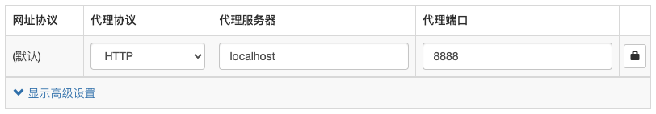

在实际的开发过程中，通常会遇到这样一个问题：本地开发需要在localhost环境，同时又需要请求线上服务器的数据。这时候会出现跨域问题，导致无法正常获取数据，本文将利用Charles来解决这个问题

### Charles配置

假设项目启动的开发环境是localhost:8000，项目中需要向test.com请求数据，而test.com服务器的配置是允许abc .com进行跨域请求，这时候可以使用Charlesl来配置。打开`Charles > Tools > Map Remote Setting`，进行如下设置，将所有对abc.com的请求全部转发到localhost:8000下

### SwitchyOmega配置

打开Chrome浏览器中下载Proxy SwitchyOmega插件

打开插件并新建情景模式，进行如下配置

注意：Mac中Charles自动启动在localhost:8888

通常，执行`npm start`后需要在Chrome中访问localhost:8000进行开发，在经过Charles和SwitchyOmega的配置后，可以直接在Chrome浏览器中输入abc.com即可进行开发，这时再向test.com发送请求的时候，浏览器会以abc.com发送请求，此时服务器收到abc.com的请求则不会出现跨域问题

### 正向代理和反向代理

#### 正向代理

当访问google.com的时候，由于墙的存在是无法访问的，这时候可以通过在国外搭建一台代理服务器，让代理服务器去请求google.com，并把请求得到的响应返回回来，这就是正向代理。我们常说的代理也就是正向代理

#### 反向代理

同样的，当访问google.com的时候，有不止一台服务器提供服务，这时候google.com就是反向代理服务器，将请求转发到某一台真实的服务器中

|  | 正向代理 |反向代理|
| -------- | -------- | -------- |
| 代理对象 | 客户端 |服务器|

#### 作用及应用场景

正向代理：隐藏真正的客户端，帮助客户端访问一些无法访问的资源。同时，通过代理服务器中的硬盘缓冲区，将部分响应保存到缓冲区中，当其他用户访问相同的内容时，直接从缓冲区中取出数据返回，以提高响应速度

反向代理：隐藏真正的服务器，同时可以做服务器的负载均衡及安全防护。对于静态内容及段时间内有大量访问请求的动态内容提供缓存服务，以提高访问速度

