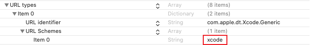

Deeplink（深层链接）能够通过URL直接打开软件，同时能够向软件中传递参数，如通过参数打开软件中的指定页面等

### 如何添加并查看Deeplink - MacOS

MacOS环境下，在`package.json`中添加如下字段后，在Electron build后会在软件的`Info.plist`文件中添加Deeplink协议

```json
{
  "build": {
    "protocol": [
      {
        "name": "myapp",
        "scheme": [
          "myapp"
        ]
      }
    ]
  }
}
```

在`Info.plist`文件中查看自定义协议的方法：

1. 打开`访达`，点击左侧`应用程序`
2. 找到软件后，右键点击`显示包内容`
3. 双击打开`Contents/Info.plist`
4. 文件中`URL types`下的`URL Schemes`即包含自定义的协议`myapp`

Xcode软件的`URL Schemes`如图所示，那么在浏览器中输入`xcode:`、`xcode://`和`xcode://myparams`等都能够打开Xcode软件



### 如何添加并查看Deeplink - Windows

Windows环境下，需要在`package.json`文件中添加如下字段，指定自定义的nsis脚本

```json
{
  "build": {
    "nsis": {
      "include": "路径/xxx.nsh"
    }
  }
}
```

在`xxx.nsh`文件中需要将Deeplink协议写入注册表，要注意，在卸载软件的时候记得卸载注册的协议

```nsis
!macro customInstall
  ; Windows下将deeplink写进注册表中
  DetailPrint "Register myapp URI Handler"
  DeleteRegKey HKCR "myapp"
  WriteRegStr HKCR "myapp" "" "URL:myapp"
  WriteRegStr HKCR "myapp" "URL Protocol" ""
  WriteRegStr HKCR "myapp\shell" "" ""
  WriteRegStr HKCR "myapp\shell\Open" "" ""
  WriteRegStr HKCR "myapp\shell\Open\command" "" "$INSTDIR\${APP_EXECUTABLE_FILENAME} %1"
!macroend

!macro customUnInstall
  ; 卸载软件的时候删除deeplink注册表
  DeleteRegKey HKCR "myapp"
!macroend
```

Windows查看自定义协议的方法：

1. 打开`注册表编辑器`
2. 在`HKEY_CLASSES_ROOT`下找到`myapp\shell\Open\command`，或者直接在上方输入`计算机\HKEY_CLASSES_ROOT\myapp\shell\Open\command`快速寻找